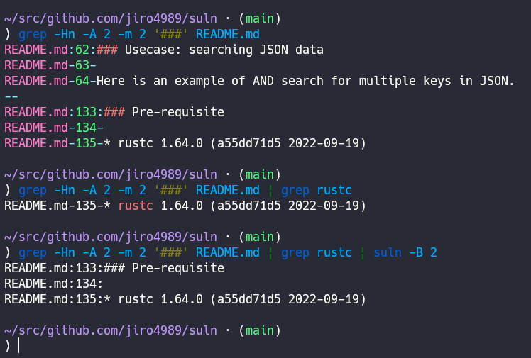

# sule

`suln` is a CLI that prints surroundings of line number with `grep`.



## Usage

Basic usage is:

```bash
grep -nH '<pattern>' '<file>' | suln <-B NUM | -A NUM | -C NUM>
```

`suln` use file name and line number with `grep`.
And `suln` provides you with continuation of `grep` .

For example, simply grep to search with file name and line number.

```bash
$ grep -Hn Usage README.adoc
README.adoc:7:== Usage
```

And, add `suln -A` (`--after-context`).
`suln` outputs the continuation of an interrupted search result.

```bash
$ grep -Hn Usage README.adoc | suln -A 2
README.adoc:7:== Usage
README.adoc:8:
README.adoc:9:Basic usage is:
```

Use `-B` (`--before-context`) if you want to search before text.

```bash
$ grep -Hn Usage README.adoc | suln -B 2
README.adoc:5:`suln` is a CLI that prints surroundings of line number with `grep`.
README.adoc:6:
README.adoc:7:== Usage
```

Use `-C` (`--context`) if you want to search before or after text.

```bash
$ grep -Hn Usage README.adoc | suln -C 2
README.adoc:5:`suln` is a CLI that prints surroundings of line number with `grep`.
README.adoc:6:
README.adoc:7:== Usage
README.adoc:8:
README.adoc:9:Basic usage is:
```

These options are same `grep`.

```bash
$ grep --help | grep -Eo '(-[ABC].+=NUM)'
-B, --before-context=NUM
-A, --after-context=NUM
-C, --context=NUM
```

### Usecase: searching JSON data

Here is an example of AND search for multiple keys in JSON.
Searches for `id` where `name` is `bob` and `age` is `18`.
This is not possible with `grep` alone.

```bash
$ grep -C 2 bob testdata/example.json
  {
    "id": 31,
    "name": "bob",
    "age": 18
  },
--
  {
    "id": 334,
    "name": "bob",
    "age": 4
  },
```

Because, `id` is disappear when search with `age`.

```bash
$ grep -HnC 2 bob testdata/example.json | grep 'age.*18'
    "age": 18
```

You must use many commands if you want to get `id`.

```bash
$ grep -C 2 bob testdata/example.json | grep -Ev '^--$' | paste - - - - - | grep 'bob.*age.*18' | grep -Eo '"id[^,]+' '"'  | awk '{print $2}'
31
```

Or, you must write complexity `jq` query.

```bash
⟩ jq -r '.[] | select(.name == "bob" and .age == 18) | .id' testdata/example.json
31
```

`suln` is useful if you would like to search more intuitive.

```bash
$ grep -HnC 2 bob testdata/example.json | grep 'age.*18'
testdata/example.json-15-    "age": 18

$ grep -HnC 2 bob testdata/example.json | grep 'age.*18' | suln -B 2
testdata/example.json:13:    "id": 31,
testdata/example.json:14:    "name": "bob",
testdata/example.json:15:    "age": 18

⟩ grep -HnC 2 bob testdata/example.json | grep 'age.*18' | suln -B 2 | grep 'id.*31'
testdata/example.json:13:    "id": 31,
```

## Installation

```bash
$ cargo install suln
```

Or, you can download and install from [GitHub Releases](https://github.com/jiro4989/suln/releases).

## LICENSE

MIT

## For developer

### Pre-requisite

* rustc 1.64.0 (a55dd71d5 2022-09-19)

### Build

```bash
cargo build
```

### Test

```bash
cargo test
```
